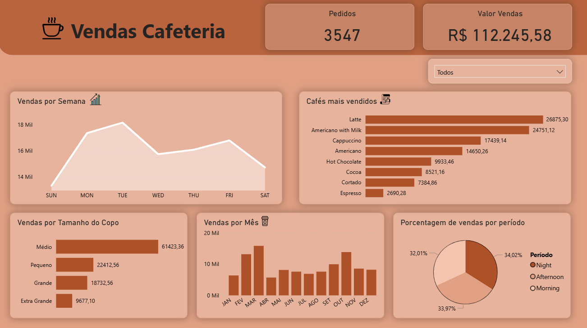

# ☕ Coffee Sales Analytics — Pipeline de Dados & Dashboard Power BI


## 🎯 Problema de Negócio

Uma cafeteria precisa entender sua performance de vendas, mas seus dados estão armazenados em formato bruto sem estrutura analítica. O objetivo deste projeto foi construir uma solução completa de Business Intelligence — da modelagem do banco de dados até o dashboard — para responder perguntas críticas como: quais produtos vendem mais? Em que períodos a receita é maior? Qual o ticket médio por tamanho de pedido?

## 📊 Dashboard



## 🛠️ Tecnologias Utilizadas

| Ferramenta | Uso |
|---|---|
| PostgreSQL | Modelagem, DDL, DML, Views |
| SQL | Tratamento, lógica de negócio, CASE WHEN, UPDATE |
| Power BI Desktop | Dashboard interativo e modelagem dimensional |
| DAX | Medidas de negócio (faturamento, volumetria) |
| Star Schema | Modelagem dimensional com tabela fato e dCalendário |

## 🏗️ Arquitetura da Solução

### 1. Camada de Dados — PostgreSQL

A infraestrutura foi construída com scripts SQL para garantir integridade e performance:

- **Tratamento de tipos:** conversão da coluna `money` para `NUMERIC` para evitar erros de precisão decimal
- **Lógica de negócio via SQL:** classificação do tamanho do copo (Extra Grande, Grande, Médio, Pequeno) usando `CASE WHEN` com base na combinação de preço e nome do produto
- **View como fonte única de verdade (SSOT):** criação da `vw_coffe_vendas` já com tratamento de datas, horas e categorias — essa view é a única fonte consumida pelo Power BI

### 2. Modelagem Dimensional — Power BI (Star Schema)

- **dCalendário:** tabela de dimensão de tempo com colunas de Ano, Mês e Semana formatadas por nome e número para ordenação correta
- **Tabela de Medidas:** centralização de cálculos separando lógica de negócio da tabela fato
  - `Soma Vendas` — faturamento total
  - `Qtd_Cafes` — volumetria de pedidos

### 3. Insights do Dashboard

| Pergunta de Negócio | Visualização |
|---|---|
| Qual o faturamento total e volume de pedidos? | Cartões de KPI |
| Como as vendas evoluem ao longo do tempo? | Vendas por Semana e por Mês |
| Quais produtos são mais vendidos? | Ranking de Cafés Mais Vendidos |
| Qual tamanho de copo domina as vendas? | Vendas por Tamanho do Copo |
| Em que período do dia há mais pedidos? | Distribuição por período |

## 📂 Estrutura do Repositório

```
📁 Analise_dados_Cafeteria/
├── coffe_sales.csv       # Dataset original
├── script.sql            # DDL, tratamentos e criação da View
├── dash.pbix             # Arquivo Power BI com modelo e visuais
└── dash_image.png        # Preview do dashboard
```

## 🚀 Como Executar

1. Execute o `script.sql` no seu PostgreSQL (pgAdmin ou psql)
2. Importe os dados do `coffe_sales.csv` para a tabela criada
3. Abra o `dash.pbix` no Power BI Desktop
4. Aponte a fonte de dados para o seu banco local nas configurações de conexão

## 📌 Aprendizados Técnicos

- Uso de `CASE WHEN` para injetar lógica de negócio diretamente na camada SQL, reduzindo transformações no Power BI
- Criação de Views como contrato de interface entre banco de dados e ferramenta de BI
- Modelagem Star Schema com tabela de calendário para análise temporal correta
- Separação entre tabela fato e tabela de medidas DAX como boa prática de BI

---


